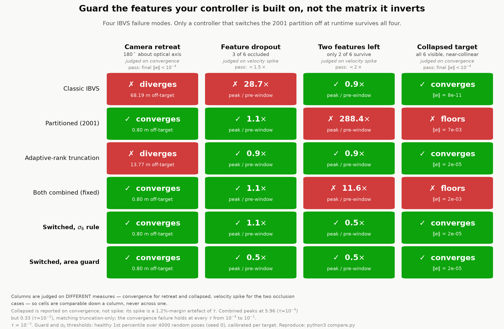
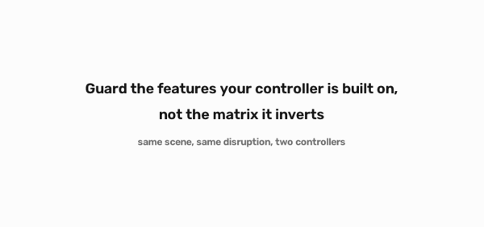

# The Blind Spot

**Guard the features your controller is built on, not the matrix it inverts.**

```python
pip install .                       # then, in your own IBVS loop:

from blindspot import FeatureGuard
guard = FeatureGuard.load("my_target.json")     # from calibration; no default
...
if guard.partition_ok(s_visible):               # normalised image coords
    v = my_partitioned_control(...)             # 2001 partition is safe
else:
    v = my_plain_control(...)                   # it is not; don't use it
h = guard.evaluate(s_visible)                   # signal, threshold, margin, n, decision
```

`python examples/quickstart.py` runs it end to end in 30 seconds with no setup.
Calibrate on a **known-good** target:
`python -m blindspot.calibrate --geometry target.json --goal-pose pose.json -o my_target.json`

A vision-guided robot working in clutter or closing the last centimetre loses
features to occlusion and has its target geometry collapse as it gets close.
When that happens the controller does not slow down or stop — it lurches, and
the standard fix for the famous failure makes two of the others worse. That is
a crooked insertion, a tripped safety stop, or a scrapped part.

**This is a simulation study of control laws, not a robot demo.** There is no
hardware and no arm: it is a free-flying camera, 143 regression tests, and 16
finite-difference checks. The control results are derived with exact feature
positions, then re-run against a **rendered MuJoCo camera with a real OpenCV
ArUco detector** — which agrees with exact projection to 0.095 px and
reproduces three of the four verdicts. Putting it on a simulated arm (joint
limits, dynamics, contact) is the next phase, not a finished one.

Image-based visual servoing has four distinct ways to go blind, and no fixed
control law survives all four. Switching the 2001 partition *off at runtime*
does — and the signal that decides the switch should be the health of the
partition's own substitute features, not the spectrum of the interaction
matrix. A one-line hand-written rule closes the gap. **No learned policy is
needed here**, which is the opposite of what this project set out to show.





*Same scene, same disruption, same seed, same runs — the only difference
between the panels is the control law.* Left: the 2001 partition left
permanently on. Right: the same controller with the feature guard deciding per
step. At t=1.98 s the fixed controller commands **|v| 5.31** against the
guard's **0.08 — a 66× gap** — and loses the target 2.0 s in; the guard
converges. The decisive window is shown at half to 5.6× slow motion, with
genuine SE(3)-interpolated frames rather than duplicated ones, and each panel
carries a live log-scale |v| trace on a shared fixed axis.
[Full-quality mp4 (19.6 s)](docs/guard_vs_fixed.mp4).

## Results

| Controller | Retreat 180° | Dropout spike | 2 features | Collapsed target | Clean cost |
|---|---|---|---|---|---|
| Classic IBVS | ✗ 68.19 m, diverges | ✗ 28.7× | ✓ 0.9× | ✓ conv, 8e-11 | baseline |
| Partitioned (2001) | ✓ 0.80 m, converges | ✓ 1.1× | ✗ 288.4× | ✗ floors at 7.3e-3 | +13% |
| Adaptive-rank truncation | ✗ 13.77 m, diverges | ✓ 0.9× | ✓ 0.9× | ✓ conv, 2.4e-5 | baseline |
| Both combined (fixed) | ✓ 0.80 m, converges | ✓ 1.1× | ✗ 11.6× | ✗ floors at 2.0e-3 | +13% |
| Switched, feature count | ✓ 0.80 m, converges | ✓ 1.1× | ✓ 0.5× | ✗ floors at 2.0e-3 | +13% |
| Switched, σ₆ spectrum | ✓ 0.80 m, converges | ✓ 1.1× | ✓ 0.5× | ✓ conv, 2.4e-5 | +13% |
| **Switched, area guard** | **✓ 0.80 m, converges** | **✓ 0.5×** | **✓ 0.5×** | **✓ conv, 2.4e-5** | **+13%** |

**Each column is judged on the measure that is robust for that failure, and the
measures differ.** Cells are comparable down a column, never across one.

- *Retreat* and *collapsed* are judged on **convergence** (final ‖e‖ < 1e-4).
- *Dropout* and *2 features* are judged on the **velocity spike**: peak
  commanded ‖v‖ inside the degradation window (steps 30–90) over that
  controller's own ‖v‖ at step 29.
- The collapsed case is deliberately **not** reported on its spike. At τ=1e-3
  the truncation threshold lands at 98.78% of σ_min(L_xy), so the spike is a
  1.2%-margin artifact: combined peaks at 5.96 (τ=1e-4) but 0.33 (τ=1e-2),
  where it matches truncation-only's 0.32. The *convergence* failure is
  τ-independent — combined floors above 1e-4 at every τ from 1e-4 to 1e-1.
- *Clean cost* is steps to drive ‖e‖ below **1% of its initial value** on an
  undegraded run, relative to classic IBVS. The threshold is part of the
  definition: the same comparison gives +2.4% at 50% and +7.4% at 0.01%.

Thresholds are the **healthy 1st percentile over 4000 random poses (seed 0)**,
calibrated per target — never tuned by hand, never fitted on a degraded run.

## Reproduce

```bash
python3 -m venv .venv && .venv/bin/python -m pip install -r requirements.txt
.venv/bin/python tests.py                                    # 143/143 and 16/16
.venv/bin/python compare.py && .venv/bin/python fig_failure_modes.py
```

`test_blindspot.py` (25 more) covers the packaged API.

`tests.py` must print **143/143** and `fd_check.py` **16/16**. `fd_check.py` verifies every
derivative and sign by finite difference rather than by reasoning about
conventions — two sign bugs in this repo were found that way and neither would
have been caught by inspection.

## What the four failures are

| Failure | What breaks | What fixes it |
|---|---|---|
| **Camera retreat** (180° about the optical axis) | *Coupling.* Nothing is near-singular; image error and Cartesian motion are structurally tangled. Image error is a useless health signal — command/error alignment sits at exactly −1.0000 at every step while the camera flies 68 m away. | The 2001 partition, outright. Truncation does nothing. |
| **Feature dropout** (3 of 6 occluded) | *Conditioning.* A direction genuinely goes blind. | Truncation declines to move along it. |
| **Two features left** | The partition's reduced 4×4 solve becomes **exactly determined** and brittle, while classic IBVS stays underdetermined and is accidentally protected by the minimum-norm solution. | Dropping the partition. |
| **Collapsed target** (all 6 visible, near-collinear) | The partition **forces** the 4 remaining DOF through an ill-conditioned `L_xy` = [3.68, 3.66, 0.0124, 0.0037], removing truncation's ability to decline the blind direction. Feature *counting* cannot see this at all — the row count never drops. | Dropping the partition. |

Camera retreat is **not** claimed as a contribution: it was solved in 1999
(2.5D visual servoing) and 2001 (partitioned IBVS). It is used as a positive
control — a failure with known ground truth, to show a signal fires on real
degeneracy rather than at random.

## Dead claims

Five of my own claims died in the making of this, plus the project's founding
hypothesis. Each is listed with the number that killed it, because the trail
is stronger evidence than the result.

1. **"Closing the 11.6× gap needs a learned policy."** *(the project's
   founding hypothesis)* — Killed by a one-line hand-written rule reaching
   **0.5×**, comfortably under the 2× bar set in advance. A learned policy is
   not needed for this decision.

2. **"A rank-margin rule on the spectrum beats counting features."** — Killed
   by finite difference: at N=2, `L_xy` is 4×4 but **numerically rank 3**, so
   `rank_τ(L_xy) < rank_τ(L)` held and the partition stayed ON in exactly the
   case where it must be dropped. The margin was measured against the wrong
   matrix.

3. **"A single global τ separates healthy-but-weak from degenerate."** —
   Killed by the measured band. A healthy ring's weak directions sit at
   σ₅/σ₁ = 1.4e-3…3.1e-3 depending on pose; a *collapsing* target's σ₅ is
   already at **8.2e-4**, below healthy. The separating band is a factor of
   **1.65–3.73**, pose-dependent. No global threshold is defensible, so the
   rank test must use an existence threshold — after which it reduces to
   counting features.

**Why the cheap signal is also the steadier one.** The guard statistic is a
polygon *area* — an aggregate over every visible point — so independent
per-point detector noise largely cancels inside it rather than propagating.
It is inherently smoothed, with no filter added. Measured: 2 px of per-point
noise moves the statistic by **0.33%** of its threshold on the 4-point square
and **0.73%** on the 6-point ring. Across all four cases at 0, 0.5 and 2 px of
feature noise the switch produces **no spurious flips at 0 and 0.5 px, and one
isolated single-step blip at 2 px** on the retreat case only; every other
transition is a sustained response to a real dip. That is a second argument
for the area guard over the spectral rule, which reads σ₆ off a single
smallest singular value and has no such averaging.

**Hysteresis was tested and rejected, not omitted.** It suppresses that one
blip, but it delays *both* edges, and the edge that matters is dropping the
partition the instant the degeneracy appears. Measured on the two-feature
case: the spike goes from **0.5× with no hold-off to 3.0× (H=2), 3.7× (H=3)
and 5.7× (H=5)** as the drop is delayed by 1, 2 and 4 steps. The cost of a
late engagement is far larger than the cost of one spurious blip, so the
default is no hysteresis. The parameter exists (`hysteresis=` in
`run_switched`) so the result can be re-checked rather than taken on trust.

4. **"The switching decision needs the interaction-matrix spectrum."** —
   Killed by the area guard **matching σ₆ on all four cases** (and beating it
   on dropout, 0.5× vs 1.1×) using no spectrum at all. The collapsed failure
   is one the partition *introduces*, so guarding the partition's own inputs
   is the honest framing. The spectral story is not load-bearing.

5. **"The collapsed-target velocity spike is evidence for switching."** —
   Killed by τ arithmetic: the τ=1e-3 threshold is **98.78%** of σ_min, and
   combined's peak falls 5.96 → 0.326 across the τ sweep against
   truncation-only's 0.322. The spike gap essentially vanishes. Only the
   convergence half of that row is real evidence.

6. **"Predicting the guard signal forward buys useful warning."** —
   *Warning is available precisely where it is not needed.* Rolling the
   features forward on the current heading with `s_next = s + L v dt` predicts
   the degeneracy the **camera** causes, never the degeneracy the **world**
   causes, and the three transitions split accordingly:

   | transition type | example | warning |
   |---|---|---|
   | camera-driven | classic IBVS retreating until the target shrinks | **231 ms** |
   | exogenous | an occluder arrives (dropout, two features) | **0 ms** |
   | already degenerate at t=0 | the collapsed target | **0 ms** (nothing to predict) |

   The idea did not die from a bad predictor. The predictor is good: one step
   is sub-pixel (0.157 px median), and measured on the decision-relevant
   quantity — error in the polygon-area statistic as a fraction of its
   threshold, stratified by speed — **K = 20 steps (660 ms) is trustworthy
   even at |v| > 1.5** (4.9% median, 9.7% p95, against a guard margin of
   13–62%). It costs 1.394 ms per control cycle. The gate passed.

   It dies on structure. With the partition on, the camera never retreats, so
   the area never falls, so the guard never trips — **the one case with
   warning is the case that never needed it.** Where the guard does fire, no
   warning exists by construction, because an occluder is not in the state
   vector. And given the 231 ms that does exist, ramping the gain down as the
   predicted time shrinks buys **4% on peak velocity (78.59 vs 82.00) and
   nothing on convergence** against simply reacting at the cliff.

   `predict.py`, locked by tests.

Two further corrections worth recording: the health metric `S[-1]` was wrong
because it compares matrices of different shapes and cannot see a null space —
on a 2-feature `L` it reads a healthy-looking **9.97e-2** where the padded σ₆
is **exactly 0**. And the collapsed-target mechanism is *not* σ = √area → 0:
σ and σ\* shrink together, so the ratio holds at **1.4980** and `vz` is
unchanged at every collapse level.

## Limits

Read these before believing any number above.

- **Exact feature positions throughout.** No rendered camera, no detector, no
  correspondence errors. Everything here is a free-flying virtual camera with
  ground-truth features. This is the single largest open question.
- **Correlated noise: tested, and the detector fails first.** Independent
  detector noise never drowned the health signal (d′ = 454 at 0.1–0.5 px, 7.1
  at a catastrophic 8 px, 15 with 20% gross outliers). Noise that *co-varies*
  with the degeneracy is the harder case and needs a rendered camera: motion
  blur driven by the camera's own measured inter-frame motion, plus a lagged
  auto-exposure chasing image brightness, so a control lurch makes its own
  blur on the same step. Measured at 10 fps with λ = 1.5 (cycle-time pressure,
  which triples inter-frame motion), on the dropout case:

  | blur across exposure | N visible | threshold used | operating margin | detector failure | run |
  |---|---|---|---|---|---|
  | 0 px | 3 | 3.296e-02 | 1.62× | 0.00% | converges |
  | 2.5 px | 3 | 3.296e-02 | 1.62× | 0.00% | converges |
  | 5.1 px | 3 | 3.296e-02 | 1.62× | 0.00% | converges |
  | 7.6 px | 3 | 3.296e-02 | 1.63× | 0.42% | converges |
  | 12.7 px | 0 | — | — | 50% | **target lost** |
  | 22.3 px | 0 | — | — | 50% | **target lost** |

  Markers are ~41 px, so the cliff sits near a quarter of a marker width. The
  guard's margin is **flat right up to the cliff and then its input vanishes**
  — it never degrades gracefully first. Correlated degradation does not *bias*
  the guard, it *removes* the guard's input, so a guard failure and a
  detection failure stay cleanly distinguishable. Per-step counts, thresholds
  and margins are dumped to `docs/guard_trace.csv`.

  **This margin is the area-guard statistic against the threshold calibrated
  for the feature count seen that step. It is NOT the σ₆ margin quoted above
  (1.19× → 45.9×) — a different statistic, and the two must not be compared.**
  At the same operating point σ₆ reads 20.56× where the area guard reads
  1.62×. An earlier version of this table reported the *healthy-phase* (N=6)
  figure of 1.13× as though it were the operating margin, which made every
  case look identical because it was the same quantity measured on the same
  pre-degradation trajectory.

  Still untested: a platform that holds speed through a degradation window.
  This controller is decelerating by then, so the bite comes from the initial
  transient.
- **Thresholds do not transfer between targets.** Healthy 1st percentile is
  3.87e-3 for the 6-point ring but 1.74e-2 for the 4-point square, 4.5× apart,
  because σ₆ carries target scale and viewing distance. Calibration is required
  per target, and per visible-feature count (see next point).
- **One margin is structurally thin.** With a single N=6 threshold, the dropout
  case clears it by only **1.19×**, because singular-value interlacing means an
  N=3 σ₆ is bounded above by the N=6 one. Conditioning the calibration on the
  visible count restores it to **45.9×**, and that is implemented — but it is a
  fix for a defect, not a free property.
- **σ₆'s only demonstrated edge over the area guard is measure-zero.** At the
  three-point danger cylinder (Michel & Rives 1993), σ₆ = 2.2e-16 while the
  polygon area is *constant to 1.5e-16 relative* — the area guard cannot fire
  even in principle. But no sustained trajectory dwells there, and with the
  goal on the cylinder every controller floors at ≈7e-4 with no winner. A
  detection difference that produces no control difference is not a result.
- **The shipped τ has a constructible case where it is worse than no
  intervention.** On the collapsed target with an initial rotation about the
  collapse line, the switched controller at the default **τ=1e-3 stalls at a
  pose error of 0.297 m**, while **plain classic IBVS converges exactly**
  (0.0000 m, ‖e‖ = 1.5e-10). Truncation is discarding a direction that is weak
  but still usable, and dropping the partition hands control to exactly that
  truncation. It is a tuning failure, not a structural one — **τ=1e-5 completes
  the same case exactly** — but the default value has a case where intervening
  is worse than doing nothing, and τ is a single global constant chosen from
  the sweep in `tau_sweep.py`. If you deploy this, sweep τ on your own
  geometry rather than inheriting 1e-3.
- **Calibrate on a KNOWN-GOOD target, never in situ.** This is a deployment
  trap with no error message. Calibrating the threshold on whatever the camera
  happens to be looking at makes the degeneracy the norm: the 1st percentile
  of a *degenerate* target's own distribution sits below its everyday value,
  so the guard never fires. Measured on the collapsed target — known-good
  threshold 7.96e-02, in-situ threshold **1.13e-02**, a factor of seven. With
  the known-good threshold the guard fires and the run converges (‖e‖ =
  2.7e-05); with the in-situ threshold the partition stays on for all 600
  steps and the run floors at 2.7e-03. The guard is silently disabled and
  everything still *looks* like it is working. Calibration belongs to
  commissioning, on a target you have verified, and the threshold ships as a
  constant.
- **With fiducial markers the collapsed case is structurally untestable.**
  The degeneracy *is* the absence of 2D extent, and an area-based marker needs
  2D extent to decode. Six distinguishable ArUco markers need more area than a
  collapsed target has: reproducing the numpy verdict requires collapse
  c ≤ 0.05, and the smallest collapse leaving six decodable markers at this
  working distance is c = 0.35 even at 2560 px wide — a factor of seven, and
  not a resolution limit. The guard's trigger condition and detector failure
  therefore coincide exactly in this regime. Real deployments need corner or
  edge features there, not markers.
- **Two targets, no hardware.** A 6-point ring and a 4-point square. Free-flying
  camera, fixed dt = 0.033 s, no actuator dynamics, no joint limits, no contact.
- **Clean cost is threshold-dependent** (+2.4% to +13%), so it is meaningless
  quoted without its convergence threshold.

## Where the controller stops and observability begins

Three configurations the controller genuinely cannot finish. In none of them
is the controller at fault.

| configuration | final ‖e‖ | final \|v\| | pose error | switched = classic? |
|---|---|---|---|---|
| permanent 2 of 6 features | 1.7e-03 (over all 6) | 3.0e-11 | **0.0695 m** | yes, and truncation too |
| 3 permanently collinear points | 8.5e-12 | 3.0e-11 | **0.1130 m** | yes, and truncation too |
| goal on the 3-point danger cylinder | 4.6e-11 | 1.5e-09 | **0.1405 m** | yes |

In each the controller drives the image error to the floor, settles at a
velocity around 1e-11, and does not thrash, oscillate or diverge. With only
two features visible it zeroes the error on the pair it can actually see to
**7.0e-12** — the 1.7e-03 residual is entirely in the four features it cannot
see.

**The decisive observation is that the control law does not matter.** Classic
IBVS, adaptive-rank truncation and the guard-switched controller all land on
the *identical* pose error — 0.0695 m, 0.1130 m — to four decimal places.
Partitioned IBVS is the exception and is far worse (0.9825 m and 1.3762 m),
which is the two-feature brittleness already documented above. The residual is
not something a better controller recovers; it is information the features
never carried. Two point features give four constraints for six degrees of
freedom; three collinear points make L rank-deficient (σ₆ = 1.3e-16); the
danger cylinder makes it singular (σ₆ = 2.2e-16).

One wrinkle worth stating rather than smoothing: on the danger cylinder,
truncation at τ=1e-3 stops at a *different* pose (0.0847 m). That is not a
better outcome — it stalls with an image error of 3.8e-04 where the others
reach 5e-11, so it simply stopped somewhere else, earlier.

The guard fires correctly in all three cases and then has nothing useful to
command. The missing capability is not a controller mode: it is acquiring
features that constrain the pose, which is perception or planning, and outside
what this repo studies.

## Five bugs the rendered port surfaced

Every one was found by measurement, not by reading the code. Two of them
produced confident wrong conclusions that were reported before being caught.

### 1. The half-pixel principal point — and the refinement that hid it

Detected feature positions carried a systematic bias of exactly
**(−0.4904, −0.5010) px** against `project()`. Not noise: a bias, the same in
both axes, and suspiciously close to half a pixel.

It is half a pixel. OpenGL maps normalised device coordinates [−1, 1] onto a
**continuous** pixel range [0, W], so the optical axis lands at continuous
coordinate `W/2`. OpenCV indexes pixel **centres**, which sit half a pixel
lower. The principal point is therefore `(W−1)/2 = 639.5`, not `W/2 = 640`.
Fixing it dropped the bias to **(+0.0096, −0.0010) px** with no refinement and
**(−0.0049, +0.0001) px** with subpixel refinement.

The part worth keeping: before the fix, three corner-refinement methods were
compared and **APRILTAG looked by far the best** — 0.127 px mean error against
0.72 px for the others. It was not better. APRILTAG's corner convention is
offset by roughly half a pixel in the opposite direction, so it was silently
**cancelling** the principal-point bug. After the fix the ranking inverts
completely:

| refinement | before fix | after fix | bias after fix |
|---|---|---|---|
| NONE | 0.7208 px | 0.1990 px | (+0.010, −0.001) |
| SUBPIX | 0.7145 px | **0.0836 px** | (−0.005, +0.000) |
| APRILTAG | **0.1266 px** | 0.5972 px | (+0.419, +0.422) |

Two errors of opposite sign, each hiding the other. Picking the refinement
method by measured accuracy alone would have locked in **both**. The bias, not
the magnitude, is what exposed it — which is the general lesson: a systematic
offset is evidence about a convention, and a mean error is not.

### 2. Mirrored markers

The camera views the target plane from its object-frame −z side. A marker seen
from behind is mirrored, and an ArUco dictionary is not mirror-invariant:
**0 of 6 detected as rendered, 6 of 6 after flipping the image**. Fixed by
mirroring the *texture*, so the detector still looks at a genuine,
correctly-oriented marker — flipping the captured frame instead would hide a
real geometry error rather than fix one.

### 3. MuJoCo's auto-computed `extent` clipped the scene

`znear`/`zfar` are derived from a model `extent` that MuJoCo computes from the
geometry. Shrinking the markers therefore moved the near plane and clipped
everything: image mean fell from **254 to 13** with no error raised. Rendering
must not depend on the geometry under test, so `extent` is now pinned.

### 4. Live renderers degrade silently — and faked a physical limit

Open `MjRenderer` instances accumulate GL resources, and past a handful the
frames come back **visually plausible but undetectable**. A feasibility sweep
that built ~30 sources in one process reported 0/6 detections for every scene
after the first. That looked exactly like a physical limit of the target
geometry, and **was reported as one**: "collapse is unrenderable". It was not.
Closing each renderer showed collapse renders cleanly down to c = 0.06. The
real limit (above) had to be established a second time, by arithmetic on both
constraints rather than by a sweep.

### 5. Ghosting in the motion-blur model

Accumulation blur with a fixed, small sub-frame count places samples further
apart than a marker, producing a row of ghost copies rather than a smear. The
detector locked onto one ghost and reported a feature **156 px** from the
truth, and detection *improved* with more blur — the signature of an artifact,
since blur cannot help. The sub-frame count now adapts so successive samples
land under a pixel apart.

## Files

| File | What it holds |
|---|---|
| `ibvs_core.py` | SE(3) utilities, virtual camera, projection, interaction matrix, classic IBVS, σ₆ health metric, scenarios |
| `partitioned.py` | Partitioned IBVS (Corke & Hutchinson 2001); `rel_tau=1e-3` gives the combined controller |
| `truncated.py` | Adaptive-rank pseudo-inverse and the truncation-only controller |
| `switched.py` | The runtime switch: `count`, `rank_margin`, `sigma6`, `sigma6_n`, `area_guard`, `alpha_guard`, and the healthy-pose calibration |
| `tests.py` | 143 regression tests. Run before and after every change |
| `fd_check.py` | 16 finite-difference checks of every derivative, sign, and null space relied on |
| `compare.py` | Regenerates the results table |
| `tau_sweep.py` | τ sensitivity and calibration-percentile sensitivity |
| `noise_study.py` | Detector-noise and depth-error study |
| `fig_retreat.py`, `fig_failure_modes.py` | Figure 1 ("image error is a liar") and Figure 2 (above) |
| `mj_scene.py` | Rendered MuJoCo camera: six ArUco markers as the same hexagon, OpenCV detection, drop-in for `project()` |
| `mj_validate.py` | The gate: rendered features vs `project()`, 0.095 px mean |
| `mj_cases.py` | The four cases with rendered features, numpy verdicts vs rendered |
| `mj_degrade.py` | Run-driven motion blur and lagged auto-exposure; `se3_log` verified by finite difference |
| `mj_correlated.py` | The correlated-degradation study and `docs/guard_trace.csv` |
| `mj_video.py` | The side-by-side video |
| `predict.py` | Forward rollout of the guard signal and "steps to guard fire" (dead claim 6) |
| `blindspot/` | The package: the guard, units, and the calibrate command. No controllers, no default threshold |
| `blindspot/reference/` | The verified controllers, as runnable examples rather than the product |
| `test_blindspot.py` | 25 tests of the API contract, including what it refuses to do |
| `examples/quickstart.py` | Runs immediately on the shipped ring target |

## Setup note

If `python3 -m venv` produces a venv with no `pip` (some distributions ship
Python without `ensurepip`), bootstrap it:

```bash
python3 -m venv --without-pip .venv
curl -sS https://bootstrap.pypa.io/get-pip.py | .venv/bin/python
```

## References

- Chaumette & Hutchinson, *Visual servo control part I: basic approaches*, 2006
- Corke & Hutchinson, *A new partitioned approach to image-based visual servo
  control*, IEEE T-RA, 2001
- Malis, Chaumette & Boudet, *2½D visual servoing*, 1999
- Michel & Rives, *Singularities in the determination of the situation of a
  robot effector from the perspective view of three points*, INRIA, 1993

## License

MIT — see [LICENSE](LICENSE).
