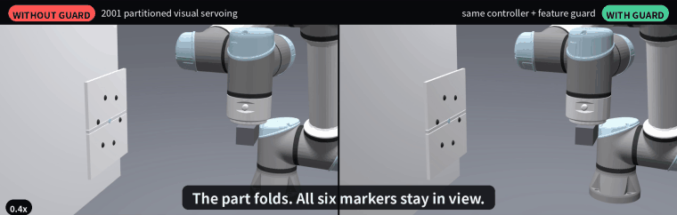
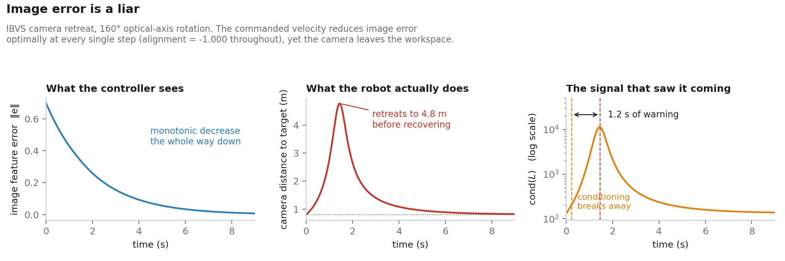

# The Blind Spot

[](https://github.com/SaurabhKhimesra/blind-spot/actions/workflows/checks.yml)

**A runtime guard for vision-guided robot arms, and the ROS 2 / Gazebo study
behind it.**



*The Gazebo act. Both cells run identical code except for one decision. Left:
the 2001 partitioned controller reads the collapsing marker pattern as
distance, drives at the part and trips its protective stop. Right: the guard
sees the partition's own feature collapse, switches control law, and holds its
standoff. ([one frame, full resolution](docs/fold_demo.jpg))*

---

A camera on a robot's wrist steers the arm by watching markers on the part —
image-based visual servoing (IBVS). The standard fix for IBVS's best-known
failure, Corke & Hutchinson's 2001 **partitioned** scheme, estimates distance
from the area of the marker pattern. When the pattern shrinks for any other
reason — the part folds, flexes, or is seen at a steep angle — the controller
concludes it is too far away and drives at the part.

This repository:

- **measures** the four distinct ways this class of controller goes blind, and
  shows the 2001 fix turns one of them into a **288× velocity spike**;
- makes the partition a **runtime decision**, and compares six candidate rules
  for making it — a one-line guard closes the worst gap from **11.6× to 0.5×**,
  with no learned policy;
- ships the guard as a **ROS 2 node** that publishes one `std_msgs/Bool`,
  driven by synthetic detections and by a live servo loop in RViz;
- runs the guard closed-loop on **two UR5e arms in Gazebo** — perception,
  guard, control law and the arm's own Jacobian at 10 Hz on simulation time.
  The arm cells call the guard library in-process rather than subscribing to
  the node, so the decision path is shared but the transport is not.

Every result is produced by code in this workspace and locked by
`colcon test`: **177 regression checks, 16 finite-difference checks, 34 API
checks.**

## Quick start

**The study needs no ROS.** The guard library and all three check suites are
pure numpy, so the numbers in this README reproduce on any machine in under a
minute:

```bash
git clone https://github.com/SaurabhKhimesra/blind-spot && cd blind-spot
pip install ./src/blindspot
regression        # 177 checks, ~20 s
fd_check          # 16 finite-difference checks
api_checks        # 34 API checks
compare           # the results table below
quickstart        # the library in 30 seconds
```

**For the ROS 2 node and the Gazebo act** — Ubuntu 26.04, ROS 2 Lyrical,
Gazebo:

```bash
sudo apt install ros-lyrical-desktop ros-lyrical-vision-msgs \
    ros-lyrical-ros-gz ros-lyrical-gz-ros2-control ros-lyrical-ros2-controllers \
    ros-lyrical-ur-description ros-lyrical-xacro ros-lyrical-urdfdom-py \
    python3-colcon-common-extensions python3-matplotlib python3-opencv python3-pytest

git clone https://github.com/SaurabhKhimesra/blind-spot && cd blind-spot
source /opt/ros/lyrical/setup.bash
colcon build && source install/setup.bash
colcon test && colcon test-result --verbose       # 3 suites, all must pass
```

Then:

```bash
ros2 launch blindspot_arm fold.launch.py          # the Gazebo act, two UR5e cells
ros2 launch blindspot_ros sim.launch.py           # servo loop through the guard, in RViz
ros2 launch blindspot_ros demo.launch.py          # guard node on synthetic detections

ros2 run blindspot regression                     # the 177 checks, printed
ros2 run blindspot compare                        # the results table, plus the rules it omits
ros2 run blindspot quickstart                     # the library in 30 seconds
```

`fold.launch.py` takes `gui:=false` for headless runs and `record:=true` to
save every camera frame by simulation timestamp — which is how the clip at the
top of this README and the per-step CSV behind the arm table are produced. It starts the servo node once
both controller managers are up, and exits when the act completes.

## Repository layout

A colcon workspace with three packages:

| package | what it holds |
|---|---|
| [`blindspot`](src/blindspot) | The guard library (`FeatureGuard`, calibration, units, the detection bridge), the control study (`blindspot.study`: classic, partitioned, truncated and switched IBVS, the scenarios, the sweeps and figures), the arm's control law, and the three check suites |
| [`blindspot_ros`](src/blindspot_ros) | The guard as a ROS 2 node, a synthetic-detection publisher, and a live servo simulation with RViz |
| [`blindspot_arm`](src/blindspot_arm) | Two UR5e cells in one Gazebo world: URDF with an eye-in-hand camera, `gz_ros2_control`, joint trajectory controllers, the folding-part world, the servo node, hand-written kinematics, blob detection, a frame recorder |

## Results

| Controller | Retreat 180° | Dropout spike | 2 features | Collapsed target | Clean cost |
|---|---|---|---|---|---|
| Classic IBVS | ✗ 68.19 m, diverges | ✗ 28.7× | ✓ 0.9× | ✓ conv, 8e-11 | baseline |
| Partitioned (2001) | ✓ 0.80 m, converges | ✓ 1.1× | ✗ 288.4× | ✗ floors at 7.3e-3 | +13% |
| Adaptive-rank truncation | ✗ 13.77 m, diverges | ✓ 0.9× | ✓ 0.9× | ✓ conv, 2.4e-5 | baseline |
| Both combined (fixed) | ✓ 0.80 m, converges | ✓ 1.1× | ✗ 11.6× | ✗ floors at 2.0e-3 | +13% |
| Switched, feature count | ✓ 0.80 m, converges | ✓ 1.1× | ✓ 0.5× | ✗ floors at 2.0e-3 | +13% |
| Switched, σ₆ spectrum | ✓ 0.80 m, converges | ✓ 1.1× | ✓ 0.5× | ✓ conv, 2.4e-5 | +13% |
| **Switched, area guard** | **✓ 0.80 m, converges** | **✓ 0.5×** | **✓ 0.5×** | **✓ conv, 2.4e-5** | **+13%** |

**Compare down a column, never across one.** Each failure is judged on the
measure that suits it:

- *Retreat* and *collapsed target*: **convergence**, final image error below
  1e-4.
- *Dropout* and *2 features*: the **velocity spike**, peak commanded ‖v‖ during
  the degradation (steps 30–90) over that controller's own ‖v‖ at step 29.
  Below 1 means the controller slowed down when information was lost.
- *Clean cost*: steps to drive the error below 1% of its initial value on an
  undisturbed run, relative to classic IBVS. The threshold is part of the
  definition — the same comparison gives +2.4% at 50% and +7.4% at 0.01%.

Thresholds are the healthy 1st percentile over 4000 random poses (seed 0),
calibrated per target, never tuned by hand.




*Camera retreat, the case that makes image error useless as a health signal:
the feature error decreases at every step while the camera flies 68 m away.*

## The four failure modes

| Failure | What breaks | What fixes it |
|---|---|---|
| **Camera retreat** (180° about the optical axis) | Coupling. Nothing is near-singular; the least-squares solution prefers backing away. Command/error alignment stays at exactly −1.0000 while the camera flies 68 m away, so image error is useless as a health signal. | The 2001 partition. Truncation does nothing. |
| **Feature dropout** (3 of 6 occluded) | Conditioning: one direction goes blind and the inverse amplifies it. | Truncation declines to move along it. |
| **Two features left** | The partition's reduced 4×4 solve becomes exactly determined and brittle, while classic IBVS stays under-determined and is protected by the minimum-norm solution. | Dropping the partition. |
| **Collapsed target** (all 6 visible, near-collinear) | The partition forces four DOF through an ill-conditioned `L_xy` = [3.68, 3.66, 0.0124, 0.0037]. Feature *counting* cannot see this — the count never drops. | Dropping the partition. |

Camera retreat was solved in 1999 (2½D visual servoing) and 2001
(partitioned IBVS); it serves here as a positive control with known ground
truth.

## The guard

The partition's substitute for depth is σ = √(area of the marker polygon), so
that is what must be healthy for the partition to be safe:

```python
from blindspot import FeatureGuard
from blindspot.ros_bridge import order_features  # the signal is order-dependent

guard = FeatureGuard.load("my_target.json")      # from calibration; no default
s_visible, _, _ = order_features(s_visible, ids) # by marker id; angular fallback

if guard.partition_ok(s_visible):                # normalised image coordinates
    v = my_partitioned_control(...)
else:
    v = my_plain_control(...)
```

**Order the points first.** The signal is a shoelace polygon area, so a
self-crossing order encloses less and reads as a collapse that has not
happened: on a healthy six-marker ring, shuffled input fires the guard on
about half of all orderings. `guard_node` does this for you; a direct library
caller must do it.

**Calibration** (`ros2 run blindspot calibrate`) samples healthy poses around
the goal and takes the 1st percentile, **per target** (thresholds do not
transfer: the ring's and the square's differ by 4.5×) and **per visible
feature count**, because a subset of the markers always spans a smaller
polygon than the full set — one six-marker threshold would make occlusion
look like degeneracy. The same holds for σ₆ through singular-value
interlacing: one threshold leaves the dropout case a 1.19× margin,
conditioning on the count restores 45.9×.

It must be done on a **known-good target**. Calibrating in situ on the
collapsed target gives a threshold 7× lower (7.96e-2 → 1.13e-2), after which
the guard never fires and every run still *looks* healthy.

**No hysteresis, by measurement.** Across all four cases at 0, 0.5 and 2 px of
feature noise the switch produces no spurious flips at 0 and 0.5 px and one
single-step blip at 2 px. Hysteresis suppresses the blip but delays the drop
that matters: the two-feature spike goes 0.5× → 3.0× → 3.7× → 5.7× for
hold-offs of 0, 2, 3 and 5 steps.

## The ROS 2 node

```bash
ros2 run blindspot_ros guard_node --ros-args \
    -p calibration:=/abs/path/my_target.json \
    -r detections:=/aruco/detections -r camera_info:=/camera/camera_info
```

| | topic | type |
|---|---|---|
| in | `detections` | `vision_msgs/Detection2DArray` |
| in | `camera_info` | `sensor_msgs/CameraInfo` |
| out | `~/partition_ok` | `std_msgs/Bool` |
| out | `/diagnostics` | `diagnostic_msgs/DiagnosticArray` |

It controls nothing — gate your own servo loop on the Bool. It refuses to
start without a calibration. Detections are ordered **by marker id** before
the polygon area is computed (a self-crossing order would fire the guard for
reasons unrelated to geometry), with an angular fallback; the ordering used is
reported, and the diagnostic escalates to ERROR if the shoelace area and the
convex-hull area disagree. Intrinsics come from `camera_info`, with a stated
`(W−1)/2` principal-point fallback.

`demo.launch.py` drives it with synthetic detections that are shuffled every
frame:

| phase | n | margin | decision |
|---|---|---|---|
| healthy, 6 markers | 6 | 1.564 | `partition_ok` |
| occluded, 2 markers | 2 | 0.000 | `drop_partition` |
| collapsed target, 6 markers | 6 | 0.221 | `drop_partition` |

The third row is the case feature counting cannot see.

## The Gazebo act: a folding part

Two UR5e cells in **one** Gazebo world, so they share a physics clock. Each
panel is two flaps on a hinge; mid-run both fold 85° in 1 s, away from the
arm, so the six markers collapse toward a line **in 3D** while all six stay in
view and detected. Both cells run the same protective stop: no commanded
motion may bring the camera within 12 cm of the part.

Measured over three runs, identical until the fold:

| | partition always on | with the guard |
|---|---|---|
| guard decision | not used | fires **0.96–0.99 s** into the fold, margin 0.87–0.90× |
| distance to the part | 26.3 cm → **protective stop at 15.9–17.2 cm**, 1.39–1.47 s in | **holds 22–24 cm** |
| markers detected | 6/6 throughout | 6/6 throughout |

The same act in numpy with the same control law module: the partition
reaches **6.8 cm** and loses the markers; the guard fires 0.9 s in and holds
**18 cm**; plain IBVS alone holds **22.5 cm** — so the partition is what
fails, not the arm or the detector.

- **σ₆ never fires** (minimum 1.29×): folding *away* from the camera adds
  depth variation, so the interaction matrix stays well conditioned. The
  feature signal catches what the spectral one cannot.
- **The guard wins a race, and only a race.** It watches the area the
  partition drives to its goal, so it fires only when the fold outpaces the
  depth loop: 75° within 1 s, 80° within 1.5 s, 85° within 2 s. Slower folds
  are masked — at 85° over 3 s the guarded cell lunges to 2 cm exactly like
  the unguarded one.
- **What the act does not show.** Held folded, the fallback creeps along an
  orbit about the hinge line that the image cannot see (‖v‖ 0.03 → 0.60 over
  4 s); re-enabling the partition mid-unfold produced a 6.05 command spike.
  The act ends 2.5 s after the fold completes for that reason
  (`t_fold:=20.0`, a 1 s ramp, `t_end:=23.5`).

The arm is driven through its geometric Jacobian, hand-written in numpy from
the URDF and verified against TF to 1e-6 m. The control law the arms run
(`blindspot.arm_law`) is the same module the regression checks import.

## Where the two signals disagree

The area guard matched the spectral signal σ₆ on three benchmark cases and
beat it on dropout (0.5× vs 1.1×), so the spectrum at first looked
unnecessary. That was a property of the test
suite, not the signals. Two cases separate them, in opposite directions.

**A healthy part seen at a steep angle.** Tilting a planar target *improves*
conditioning (σ₆ rises ~15×) while the projected area shrinks:

| | area margin | σ₆ margin |
|---|---|---|
| healthy, face-on | 1.69× | 1.88× |
| healthy, 70° | **0.99× — fires** | 27.01× — silent |
| healthy, 75° | **0.86× — fires** | 28.72× — silent |
| collapsed in 3D, c = 0.5 | 1.19× — misses | **0.74× — fires** |
| collapsed in 3D, c = 0.05 | 0.38× — fires | 0.07× — fires |

**The retreat benchmark from an imperfect start.** Its exact 180° start is a
symmetric special case where the partition's sideways command is zero
(2.1e-15). From a start 2 cm or 3° off, all of that command lands in the two
weakest directions of `L_xy`, ~130× below the strongest — an orbit about the
target (vx = −Z·ωy) — and the view swings nearly edge-on. Over 100 random
starts at 180°:

| | switched | converged | lost target edge-on | furthest | peak tilt, median / max |
|---|---|---|---|---|---|
| partition always on | 0 | 97 | 3 | 0.80–0.81 m | 84° / 89° |
| σ₆ guard | 0 | 97 | 3 | 0.80–0.81 m | 84° / 89° |
| area guard | 100 | 100 | 0 | 2.02–2.88 m | 76° / 78° |

σ₆ is right that the target is healthy and inherits every orbit; the area
guard is wrong about why the view shrinks, backs away 2–3 m, and never loses
the target. Widening its calibration range only slides along the trade.

The area statistic is ~3× steadier under noise (2 px moves it 0.33% of
threshold vs 1.03% for σ₆), but in closed loop σ₆ made no noise-induced
switch, while 0.5 px of noise triggers the orbit false positive from the exact
start. **Neither signal dominates**, and both failure directions are locked by
checks.

## Hypotheses tested and rejected

Each is locked by a check, with the measurement that settled it.

1. **Choosing the law per step needs a learned policy.** A bar of 2× was set
   before running anything; a one-line rule reached **0.5×**.
2. **A rank-margin rule on the spectrum beats counting features.** At two
   features `L_xy` is 4×4 but numerically rank 3, so the rule kept the
   partition on exactly when it had to go.
3. **One global τ separates healthy-but-weak from degenerate.** Healthy weak
   directions sit at σ₅/σ₁ = 1.4e-3…3.1e-3; a collapsing target's is already
   8.2e-4. The band moves with pose.
4. **The collapsed-target velocity spike is evidence for switching.** At
   τ = 1e-3 the truncation threshold sits at 98.78% of σ_min, and the spike
   moves 5.96 → 0.33 across a τ sweep. Only the convergence failure is real.
5. **Predicting the guard signal forward buys warning.** It predicts the
   degeneracy the camera causes (231 ms of warning) but never the one the world
   causes (0 ms) — and with the partition on, the camera-caused case never
   happens.
6. **The obvious health metric `S[-1]`.** It compares matrices of different
   shapes: on a two-feature `L` it reads a healthy 9.97e-2 where the padded
   σ₆ is exactly 0.

## Limitations

- **Simulation only.** A free-flying camera with exact features for the
  study; a simulated UR5e with rendered cameras and a blob detector for the
  demo. No hardware.
- **The guard only wins a race** against the controller it guards (above).
- **Some configurations carry no information.** Two features permanently,
  three collinear points, a goal on the three-point danger cylinder: classic,
  truncated and switched IBVS all land on the identical pose error (0.0695 m,
  0.1130 m) — the guard fires correctly and has nothing better to command.
- **The shipped τ has a worse-than-nothing case.** On a collapsed target with
  an initial rotation about the collapse line, τ = 1e-3 stalls at 0.297 m while
  plain classic IBVS converges exactly; τ = 1e-5 completes it. Sweep τ on your
  own geometry (`ros2 run blindspot tau_sweep`).
- **Thresholds do not transfer between targets**, and must come from a
  known-good one.
- **The guard signal is order-dependent**, and ordering is the caller's job
  (above). `guard_node` orders by marker id and escalates the diagnostic to
  ERROR when the order still looks self-crossing — but it publishes the
  decision anyway, so treat an ERROR diagnostic as a reason to ignore the
  `Bool`, not as a fail-safe.
- **No lens distortion.** `camera_info`'s `D` is ignored and the pinhole model
  is assumed; undistort your detections upstream if your lens needs it.
- **`camera_info` is subscribed `TRANSIENT_LOCAL`.** Drivers that publish it
  `VOLATILE` — most of them — are QoS-incompatible and will never connect.
  Republish with matching durability, or pass `fovy_deg` instead.
- **The Gazebo numbers are from three manual runs**, not from `colcon test`:
  reproduce them with `fold.launch.py` and its per-step CSV. Everything in the
  study tables is locked by a check; the arm table is not.

## Verification

- `colcon test` runs three suites: **177** regression checks locking every
  number above, **16** finite-difference checks of every derivative and sign
  the controllers rely on, and **34** checks of the library API and the ROS
  detection bridge, including the things they refuse to do.
- Derivatives are verified by finite difference rather than by reasoning about
  sign conventions; two sign bugs in the partitioned law were found that way.
- The guard node was verified on ROS 2 Lyrical (Ubuntu 26.04, Python 3.14),
  which exposed a shutdown bug the earlier Jazzy build did not: on Lyrical,
  `spin()` raises `ExternalShutdownException` on Ctrl-C, not
  `KeyboardInterrupt`.

## References

- Chaumette & Hutchinson, *Visual servo control part I: basic approaches*, 2006
- Corke & Hutchinson, *A new partitioned approach to image-based visual servo
  control*, IEEE T-RA, 2001
- Malis, Chaumette & Boudet, *2½D visual servoing*, 1999
- Michel & Rives, *Singularities in the determination of the situation of a
  robot effector from the perspective view of three points*, INRIA, 1993

## License

MIT — see [LICENSE](LICENSE).
